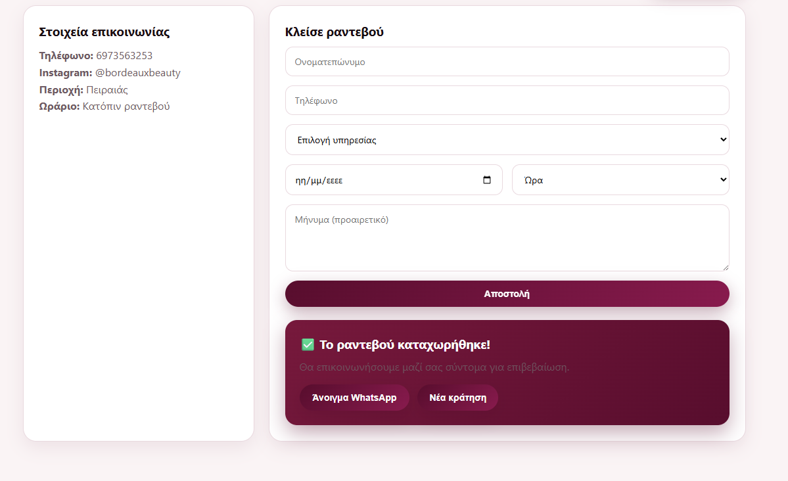
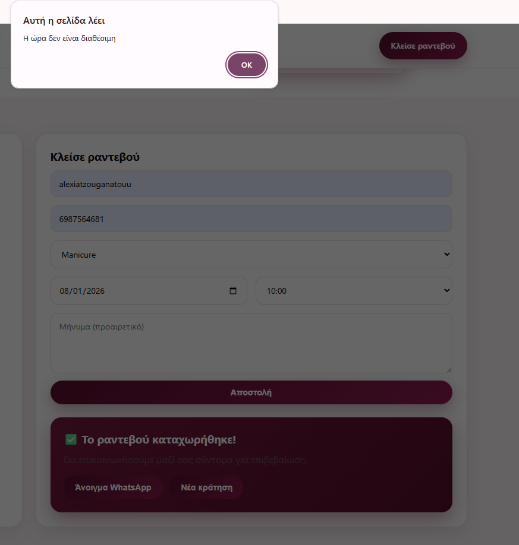

# 💅 Bordeaux Beauty – Booking Website

Ένα σύγχρονο και κομψό website για beauty & nails studio με σύστημα κρατήσεων, σχεδιασμένο και υλοποιημένο από εμένα ως προσωπικό portfolio project.

Το project συνδυάζει **Frontend (HTML, CSS, JavaScript)** και **Backend (Node.js, Express & MySQL)**, προσεγγίζοντας τη λογική μιας πραγματικής επαγγελματικής εφαρμογής.

---

## 🌸 Project Overview

Η ιστοσελίδα επιτρέπει στον χρήστη να:
- περιηγηθεί στις υπηρεσίες
- δει δείγματα δουλειών
- κλείσει ραντεβού εύκολα μέσω φόρμας
- λάβει επιβεβαίωση και έτοιμο μήνυμα WhatsApp

Το design ακολουθεί **minimal & elegant αισθητική**, εμπνευσμένη από beauty brands.

---

## 🎨 Design & Branding

- ✨ **Το logo έχει σχεδιαστεί και δημιουργηθεί εξ ολοκλήρου από εμένα**
- Custom χρωματική παλέτα (Bordeaux)
- Καθαρό UI χωρίς frameworks
- Responsive design (mobile / tablet / desktop)

---

## 💻 Frontend Features

- HTML5, CSS3, Vanilla JavaScript
- Responsive layout
- Σελίδες:
  - Home
  - Υπηρεσίες
  - Επικοινωνία / Κλείσε ραντεβού
- Φόρμα κράτησης με:
  - Ονοματεπώνυμο
  - Τηλέφωνο
  - Υπηρεσία
  - Ημερομηνία & ώρα
  - Προαιρετικό μήνυμα
- Success message μετά την καταχώρηση
- Δημιουργία έτοιμου μηνύματος WhatsApp

---

## 🛠️ Backend (Local Demo)

Το backend έχει υλοποιηθεί και δοκιμαστεί **τοπικά**.

### Backend λειτουργίες:
- Node.js & Express
- MySQL database
- Έλεγχος διαθεσιμότητας ώρας (αποφυγή διπλών κρατήσεων)
- Αποθήκευση ραντεβού στη βάση δεδομένων
- API endpoint για booking
- Χρήση `.env` για μεταβλητές περιβάλλοντος

> ⚠️ Σημείωση: Το backend δεν είναι ενεργό στο GitHub Pages, καθώς δεν υποστηρίζεται server-side code. Το project λειτουργεί ως **frontend demo online** και **full-stack demo τοπικά**.

---

## 📸 Backend Demo (Local)

### ✅ Επιτυχής καταχώρηση ραντεβού

### ⏰ Έλεγχος διαθεσιμότητας ώρας

---

## 🚀 Deployment

- **Frontend:** GitHub Pages  
- **Backend:** Local (Node.js)

Μελλοντικά:
- Online backend deployment (Render / Railway / Fly.io)
- Admin panel
- Email confirmations
- Calendar view

---

## 👩‍💻 Author

**Αλεξία Τζουγανάτου**  
Computer Science Student – Web Development & UI/UX  
📍 Greece  

Το project δημιουργήθηκε ως portfolio project με στόχο την ανάδειξη δεξιοτήτων σε:
- Frontend Development
- Backend Logic
- UI / UX Design
- Database Design

---

✨ Ευχαριστώ που το επισκεφθήκατε!
